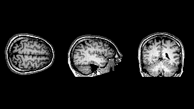

# MRI-net

Aditya just learned about CNNs and was looking into their applications when he came across medical imaging and he was hooked. He dug into work from actual medical imaging research centers and figured, why not try to replicate it himself?

He got to work on MRI datasets, trying to classify tumors. After several attempts, he finally got a model running. Not perfectly, but hey, it works!



Once classification was up, he started wondering: could he get the model to actually reconstruct the MRIs too? So he dove into that next, tweaking and adding to the pipeline late into the night.

Now his model has a bunch of issues, and after working on it for way too long, Aditya is tired, confused, and honestly not sure where things went wrong anymore.

So help him out! Somewhere in here, a few bugs have snuck in. Find them and get Aditya's model back on track.

## How it works

This repository is organized as a module containing the end-to-end pipeline
for the project. The project centers on a brain MRI tumor classification
model, with a supporting reconstruction objective to help the model learn
better representations.

1. A **CNN backbone** classifies brain MRI scans into tumor categories.
2. A **reconstruction head** reconstructs the input image alongside
   classification, encouraging the model to learn richer, more meaningful
   features rather than just memorizing shortcuts.

See `MRI_net/model.py` for the architecture, and `MRI_net/main.py` for how
training, evaluation, and serving are wired together.

## Project Structure

MRI_net/
├── data.py
├── model.py
├── train.py
├── evaluation.py
├── config.py
├── api.py
main.py

## Setup

This project uses `uv`, a Python project manager.

Install `uv`:

```bash
# macOS / Linux
curl -LsSf https://astral.sh/uv/install.sh | sh

# Windows (PowerShell)
powershell -ExecutionPolicy ByPass -c "irm https://astral.sh/uv/install.ps1 | iex"
```

Get the project running:

```bash
git clone https://github.com/anushka-priya/MRI-net.git
cd MRI-net
uv sync
uv run python -m MRI_net.main train
```

## Found a Bug?

Head over to the [Issues tab](https://github.com/anushka-priya/MRI-net/issues).
Pick one, and check [CONTRIBUTING.md](https://github.com/anushka-priya/MRI-net/blob/main/CONTRIBUTING.md)
for how to submit a fix.